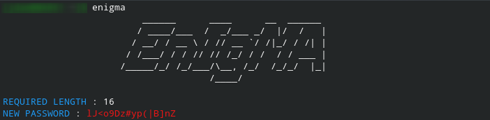

# ENIGMA
> Strong pass-phrases more securely with high complexity

## Table of contents
* [General info](#general-info)
* [Screenshots](#screenshots)
* [Technologies](#technologies)
* [Setup](#setup)
* [Features](#features)
* [Status](#status)
* [Inspiration](#inspiration)
* [Contact](#contact)

## General info
A needy tool that should be handy for every privacy geeks. Generating more complex passwords that ensures your onliine safety to an extent and thus Enigma comes for your service.

## Screenshots

## Technologies
* Bash   - version 5.1
* Python - version 3.9.1
    - ansicolors  - version 1.1.8
* Figlet - version 2.2.5

## Setup
It is a straight forward tool  which requires execution of the bash  script named 'enigma'. Figlet must be installed prior to the installation of Enigma as a the banner display is dependent on it. A python module named ansicolors must be installed using any means like that of pip, then you are all set to go

## Code Examples
Show examples of usage:
`enigma`

## Features
List of features ready and TODOs for future development
* Generating Strong and complex pass-phrases
* Determining the length

To-do list:
* Sentence making functionality
* Ability to determine complexity by controling patterns

## Status
Project is: _in progress_ and why?
    This is my second Github project and a better documented than my first, I am a total noob in github and there are much more talented minds than my lazy one,feel free to contribute ;P

## Inspiration
A big thanks to [@ritaly](https://github.com/ritaly) you rock dude, without her README-cheatsheet this project's documentation would have  been a pain in my ass.

## Contact
Created by [@mrJudyAbraham](https://twitter.com/mrJudyAbraham) - feel free to ping me!